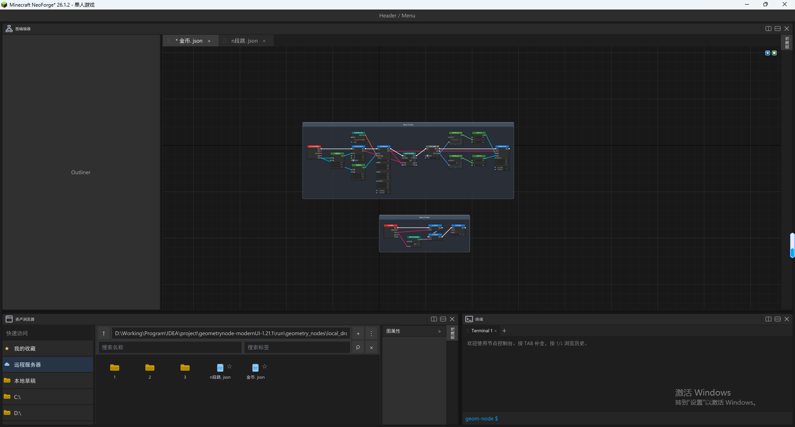

# GeometryNode

[中文](docs/README_CN.md) | [English](README.md)

GeometryNode is a visual node programming mod for Minecraft, designed to provide a creative experience inspired by Unreal Engine Blueprints and Blender Geometry Nodes.

The project aims to let creators organize logic and data through in-game node graphs instead of repeatedly writing traditional code for every gameplay feature:

- Build gameplay logic with events, execution flow, variables, and action nodes inspired by UE Blueprints.
- Generate, combine, and process geometry procedurally, inspired by Blender Geometry Nodes.
- Edit, save, load, and execute node graphs so they can directly drive interactions and visuals in the Minecraft world.

The project is still under development. Node APIs, graph data formats, and runtime architecture may continue to change.

## License

GeometryNode is licensed under the [MIT License](LICENSE).

## Interface Preview

